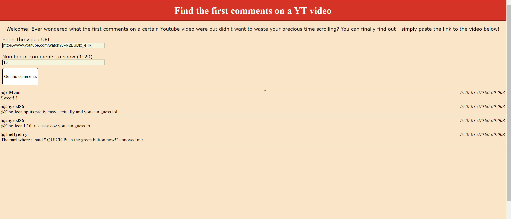

### Description

FirstComment is a web application that allows you to find the oldest comments of a given YouTube video (for many years now it's impossible to sort YouTube comments by oldest first).
This is a quick project that I used to learn (outdated, but still) basics of HTML, CSS and JavaScript (JQuery).

### Usage 
YouTube API is used to fetch the comments, so before you start using the service, make sure to paste your API key in "FirstComment.js" file. 
Click [here](https://developers.google.com/youtube/v3/getting-started) for more information on how to obtain the key.

### Caveats
- Due to the limited number of API request numbers you are allowed to make per day, trying to fetch the first comments on very popular videos is likely not going to give correct results.
- This likely won't work on more modern "shorts" style videos.
- The dates of the comments seem to be bugged - since this is a very old project, some changes must have been made in how the data is delireved by the API.

### Example

    

